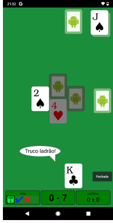

# miniTruco Android

O miniTruco é um jogo de truco para celulares, tablets e outros dispositivos Android.

Ele é completamente gratuito, sem anúncios, leve e não precisa de internet para jogar sozinho (ou em até quatro pessoas, via Bluetooth). Em breve também será possível jogar via internet.

O jogo suporta as variantes mais comuns do truco (paulista e mineiro), com opções para jogar com baralho limpo ou manilha velha. Ele se adapta a diferentes formatos, orientações e resoluções de tela e permite configurar diversos aspectos visuais.

É um software livre, sem fins lucrativos, desenvolvido por hobby e com :heart: no meu tempo pessoal (com valiosas colaborações de outras pessoas).

Você pode usar e modificar o código como quiser, dentro dos [termos da licença BSD](LICENSE). Consulte a **[documentação para desenvolvimento](docs/desenvolvimento.md)** para saber mais sobre o funcionamento e como contribuir.

## Créditos

**[Carlos Duarte do Nascimento](https://chester.me/sobre)** ([@chesterbr](https://github.com/chesterbr)): idéia, desenvolvimento, manutenção e artes diversas.

### Colaborações em uso

- **[Acturko](https://www.fiverr.com/acturko)**: baralhos em estilo tradicional
- **[Leonardo Sellani](https://www.linkedin.com/in/leonardosellani/)**: estratégia de bot
- **[Rodolfo Vasconcelos](https://www.linkedin.com/in/rodolfo-de-andrade-vasconcelos/)**: seleção manual de servidor Bluetooth
- **[Sandro Gasparoto](https://www.linkedin.com/in/sgasparoto/)**: estratégia de bot
- **[Vanessa Sabino](https://baniverso.com)** ([@bani](https://github.com/bani)): logotipo, cartas e baralho [Android](https://www.digitaltrends.com/mobile/who-is-bugdroid-the-story-of-androids-mascot/)

### Colaborações anteriores

- **[Guilherme Caram](https://www.linkedin.com/in/guilherme-caram-meireles/)** ([@gcaram](https://github.com/gcaram)): Tento mineiro original
- **[Willian Gigliotti](https://www.linkedin.com/in/willian-gigliotti/)**: Estratégia de bot

### Software de terceiros

- [Color Picker](https://github.com/jaredrummler/ColorPicker) © 2016 Jared Rummler / © 2015 Daniel Nilsson. Licensed under the [Apache License, Version 2.0](https://github.com/jaredrummler/ColorPicker/blob/master/LICENSE).
