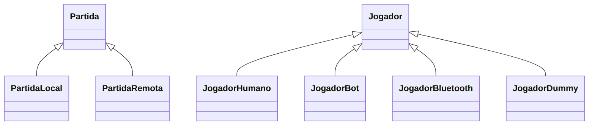
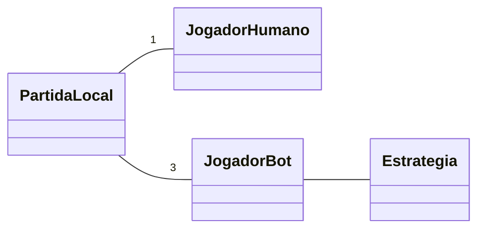
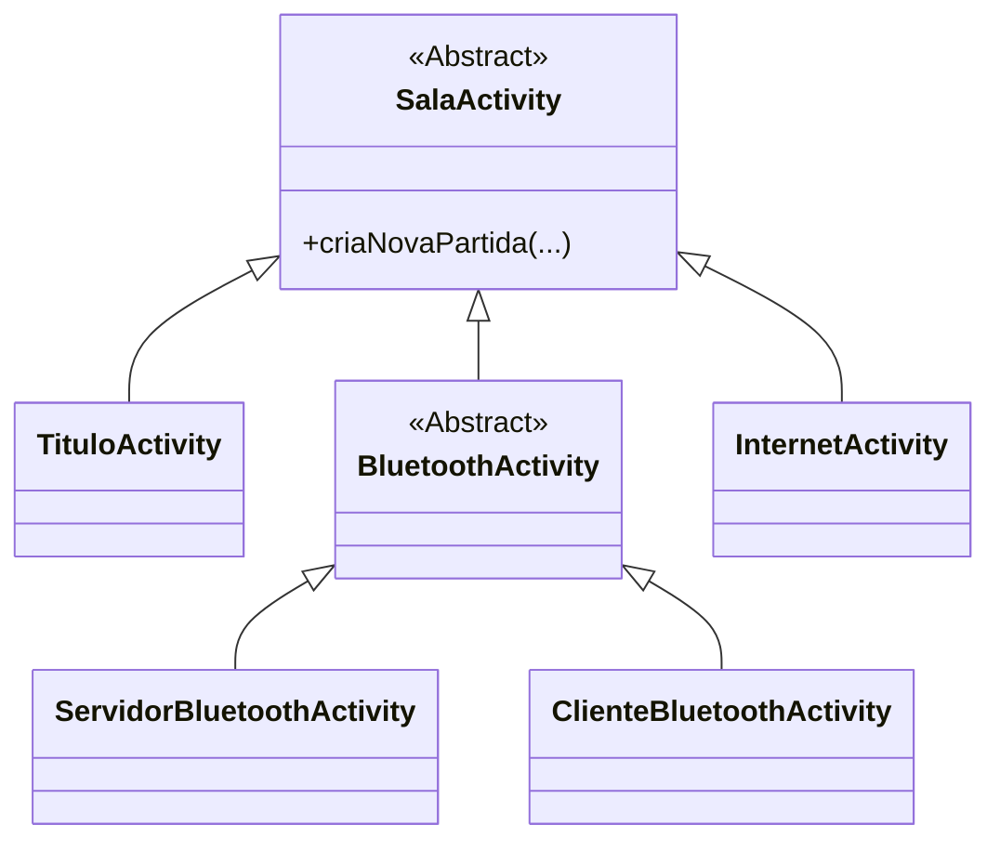
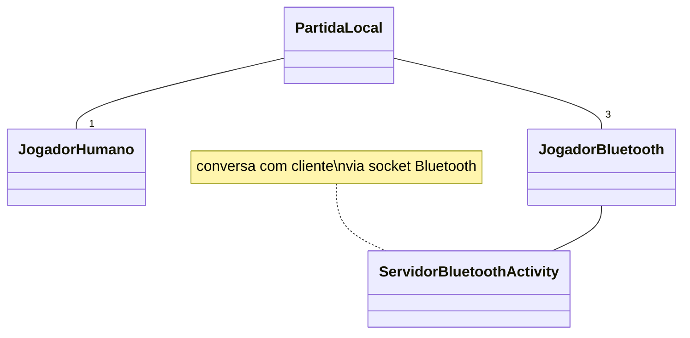
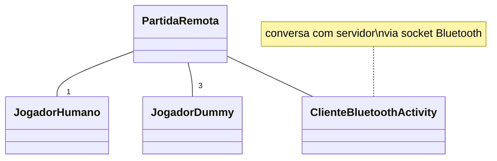
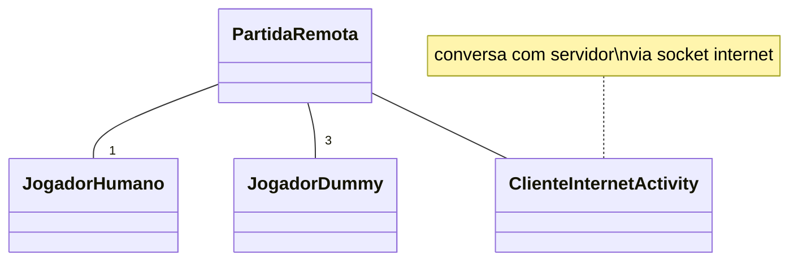

<!-- omit in toc -->
# miniTruco - Documentação para Desenvolvimento

- [Introdução](#introdução)
- [Contribuindo](#contribuindo)
  - [No que eu posso contribuir?](#no-que-eu-posso-contribuir)
  - [Como contribuir](#como-contribuir)
- [Diretrizes e decisões](#diretrizes-e-decisões)
- [Ambiente de Desenvolvimento](#ambiente-de-desenvolvimento)
  - [Convenções de código](#convenções-de-código)
  - [Testes (ou falta de)](#testes-ou-falta-de)
- [Organização do Projeto](#organização-do-projeto)
- [Terminologia](#terminologia)
- [Arquitetura de Classes](#arquitetura-de-classes)
  - [Partidas e Jogadores](#partidas-e-jogadores)
  - [Jogo simples (single player)](#jogo-simples-single-player)
  - [Jogo Multiplayer](#jogo-multiplayer)
    - [Diferenças conceituais em relação ao single-player](#diferenças-conceituais-em-relação-ao-single-player)
    - [Implementação](#implementação)
  - [Jogo via Bluetooth](#jogo-via-bluetooth)
  - [Jogo via Internet](#jogo-via-internet)
- [Protocolo de comunicação multiplayer](#protocolo-de-comunicação-multiplayer)
  - [Testando (jogando) via nc/telnet](#testando-jogando-via-nctelnet)
  - [Convenções](#convenções)
  - [Comandos](#comandos)
    - [Fora da sala](#fora-da-sala)
    - [Dentro da sala (fora de jogo)](#dentro-da-sala-fora-de-jogo)
    - [Dentro da sala (fora de jogo e gerente)](#dentro-da-sala-fora-de-jogo-e-gerente)
    - [Durante o jogo](#durante-o-jogo)
    - [A qualquer momento](#a-qualquer-momento)
  - [Notificações](#notificações)
- [Estratégia dos bots](#estratégia-dos-bots)
  - [Assets gráficos](#assets-gráficos)

## Introdução

O miniTruco é um jogo de truco para celulares, tablets e outros dispositivos Android. É um projeto de software livre, desenvolvido por hobby no meu tempo pessoal (com valiosas [colaborações](../README.md#créditos) de outras pessoas).

O nome "miniTruco" é uma alusão ao fato de que a [versão original](https://github.com/chesterbr/minitruco-j2me) (feita para [Java ME](https://en.wikipedia.org/wiki/Java_Platform,_Micro_Edition) e depois portada para Android) rodava até em celulares com pouca memória (64K) e tela minúscula (através de um baralho desenhado [pixel](https://github.com/chesterbr/minitruco-j2me/blob/aabad635b34eee346cd7e12324f471c70ed16836/miniTruco/res/naipes.png) a [pixel](https://github.com/chesterbr/minitruco-j2me/blob/aabad635b34eee346cd7e12324f471c70ed16836/miniTruco/res/valores.png)). Embora a realidade dos aparelhos de hoje seja outra, o nome ainda simboliza o compromisso com o minimalismo e a inclusão.

Você pode usar e modificar o código como quiser, dentro dos [termos da licença](../LICENSE). O objetivo deste documento é ajudar qualquer pessoa interessada a configurar, entender e/ou aprimorar este código.

Saiba mais sobre o autor aqui: https://chester.me/sobre/

## Contribuindo

### No que eu posso contribuir?

Uma área que sempre pode ser melhorada é a de estratégias (veja a seção "[Estratégia dos bots](#estratégia-dos-bots)"); correções de bugs específicos de celulares ajudam muito também, já que eu não tenho muitos à disposição.

A cobertura e infra-estrutura de testes também são áreas que precisam de amor, ainda mais porque tenho pouca experiência com isso em Android e Java (e o código não foi originalmente escrito com testes em mente); vide a seção "[Testes (ou falta de)](#testes-ou-falta-de)".

Devido ao compromisso de rodar no maior número de celulares possível, não pretendo incluir coisas como vozes e gráficos super sofisticados. No entanto, colaborações para melhorar os gráficos/UI que não excluam aparelhos mais simples e versões mais antigas do Android são bem-vindas.

No mais, existem vários issues [abertos](https://github.com/chesterbr/minitruco-android/issues) ([bugs](https://github.com/chesterbr/minitruco-android/issues?q=is%3Aopen+is%3Aissue+label%3Abug), [melhorias](https://github.com/chesterbr/minitruco-android/issues?q=is%3Aopen+is%3Aissue+label%3Amelhoria) e [débitos técnicos](https://github.com/chesterbr/minitruco-android/issues?q=is%3Aopen+is%3Aissue+label%3A%22d%C3%A9bito+t%C3%A9cnico%22)). Fique à vontade para comentar neles, ou para criar um novo caso tenha algum sugestão/problema não coberto por eles.

### Como contribuir

[Pull requests](https://docs.github.com/pt/pull-requests) são bem-vindas, mas não há garantia de aceite (em particular devido à baixa cobertura de testes, que me obriga a testar tudo muito cuidadosamente).

Se você for trabalhar em algum issue com intenção de fazer um pull request, sugiro comentar no issue primeiro, evitando duplicação de esforços e dificuldades na hora de fazer o merge.

Familiarize-se com esta documentação, com as regras do truco e com o código-fonte antes de começar a contribuir. Se tiver alguma dúvida, pode abrir um issue ou entrar em contato comigo de outra forma.

## Diretrizes e decisões

As **diretrizes do projeto** são:

- Rodar até nos aparelhos mais modestos e versões mais antigas do Android que ainda estejam em uso no Brasil (com base nas estatísticas da Play Store).
- Suportar o maior número viável de variantes locais (eu costumo dizer que truco pode ser usado como GPS, porque você anda um pouco e a regra muda).
- Promover a inclusão (que às vezes falta até no truco "de verdade", por exemplo quando a irreverência cruza o limite e vira preconceito).

Isto orienta algumas **decisões de design e implementação**, tais como:

- Foco na plataforma Android, que é a mais popular no Brasil.
- Interface adaptável a diferentes resoluções, tamanho de tela e orientações.
- Suportar o jogo local (contra bots), via Bluetooth (sem o uso de internet) ou online (este último em desenvolvimento).
- Prioridade ao idioma português (tanto na interface quanto no código-fonte).
- Uso de termos amigáveis para não-_gamers_, por exemplo, "internet" ao invés de "online", sempre que possível (exceções como "bot" e "Bluetooth" foram feitas por eu não ter encontrado tradução adequada).
- Evitar a presunção de gênero ou qualquer outra característica pessoal da pessoa que joga.
- Não usar anúncios ou qualquer outro tipo de monetização, growth hack, promoção, coleta de dados, cadastro, parceria, mecânica de engajamento, clickbait, etc.
- Uso de `Layout`s tradicionais ao invés de Compose/Flutter/etc. para suportar versões mais antigas do Android, com a UI principal do jogo em uma `View` customizada ([`MesaView`](../app/src/main/java/me/chester/minitruco/android/MesaView.java)).
- Permanecer no [Java](https://www.java.com/pt-BR/) e (por ora) não migrar para [Kotlin](https://kotlinlang.org/) (ao menos não enquanto eu não me convencer do [compromisso do Google](https://killedbygoogle.com/) com a linguagem).

Estas duas últimas decisões podem ser influenciadas pela possibilidade de migrar para outras plataformas no futuro (ex.: [iOS](https://www.apple.com/br/ios/), [Windows](https://www.microsoft.com/pt-br/windows), [Linux](https://www.linux.org/), [Web](https://developer.mozilla.org/pt-BR/docs/Web)), mas por enquanto não há planos concretos nesse sentido.

## Ambiente de Desenvolvimento

O projeto usa o [Gradle](https://gradle.org/) para gerenciamento de dependências e build. A IDE usada atualmente é o [Android Studio](https://developer.android.com/studio), mas pode ser importado em outras IDEs que suportem Gradle.

Em princípio, basta abrir o projeto no Android Studio e toda a configuração deve acontecer automaticamente, permitindo executar em dispositivos virtuais ou físicos.

O servidor internet usa Virtual Threads, que são um feature preview; então para rodar ele é preciso baixar um OpenJDK 19 (o 20 não rola porque o Gradle não suporta rodar sob ele) e selecionar como target do Gradle no Android Studio (em Preferences => Build, Execution, Deployment => Build Tools => Gradle). No Mac, se você baixar [daqui](https://jdk.java.net/19/) e colocar sob `/Library/Java/JavaVirtualMachines/OpenJDK/`, ele deve aparecer na lista de targets (além disso, os shims do MacOS também vão achar, se for o JDK mais recente dentro de `/Library/Java/JavaVirtualMachines`, ou seja, `java`, `javac`, `./gradlew` e assemelhados vão encontrar de boa).

Eu recomendo testar em dispositivos físicos mesmo, em particular se for usar Bluetooth (o emulador do Android Studio até simula Bluetooth, mas mas só em versões recentes do Android, e limitado a dois dispositivos), mas é totalmente possível desenvolver sem um.

### Convenções de código

Comentários, variáveis e afins usam o português do Brasil, o mesmo valendo para mensagens de commit. Por conta disso, é recomendado desligar, no Android Studio a checagem de ortografia (`Preferences` => `Editor` => `Inspections` => `Proofreading` => `Typo`), pois ela assume inglês.

As convenções de código estão no arquivo [`.editorConfig`](../.editorConfig), e o Android Studio deve adotar elas automaticamente. Sim, você vai encontrar código que não adere a elas ainda; eu estou tentando melhorar isso aos poucos.

### Testes (ou falta de)

Quando este projeto começou, eu não tinha qualquer conhecimento da cultura de testes no desenvolvimento de software - isso só veio quando ele já estava portado para Android - e o ferramental para este ambiente (ou minha capacidade de utilizar ele) era um tanto limitado.

Com o isolamento do módulo  `core` foi possível adicionar o [JUnit 5](https://junit.org/junit5/) e um primeiro conjunto de testes unitários (mais uma tentativa de teste de integração).

O próximo passo será ampliar a cobertura de testes no `core`, e depois expandir para outros módulos e rodar os testes automaticamente. Esse processo pode ser acompanhado em [#41](https://github.com/chesterbr/minitruco-android/issues/41), e toda ajuda é bem-vinda.

## Organização do Projeto

O projeto está dividido em três módulos Gradle:

- `core`: contém a lógica do jogo, independente de plataforma
- `app`: contém a implementação do aplicativo Android
- `server`: contém o servidor para jogo online (atualmente em desenvolvimento e com o acesso escondido no aplicativo).

## Terminologia

O [vocabulário típico do truco](https://www.jogosdorei.com.br/blog/girias-do-truco/) é usado sempre que possível, mas alguns termos são necessários para evitar ambiguidades e consolidar os diferentes modos de jogo:

- **Aumento**: quando um jogador pede para aumentar o valor da rodada ("truco", que aumenta para 3 ou 4 pontos, "seis", "oito"/"nove" ou "doze", conforme o modo de jogo).
- **Mão de X**: é a mão de 11 do truco paulista, ou mão de 10 do truco mineiro (quando apenas uma das duplas tem essa pontuação e pode optar por jogar ou não).
- **Baralho**: visualmente, é o bitmap desenhado quando a carta está fechada (valor virado para baixo). Três dessas cartas são desenhadas no canto superior direito para simbolizar o baralho todo. Não confundir com a classe [`Baralho`](../core/src/main/java/me/chester/minitruco/core/Baralho.java), que faz parte do core e é quem sorteia as [`Carta`](../core/src/main/java/me/chester/minitruco/core/Carta.java)s.
- **Posição**: visualmente, o jogo define a posição de um jogador como um número de 1 a 4. A posição 1 está na parte inferior da tela, a 2 na direita, a 3 acima e a 4 à esquerda. As posições 1 e 3 formam uma dupla, e as posições 2 e 4 formam a outra.
-
## Arquitetura de Classes

### Partidas e Jogadores

Uma partida pode envolver jogadores humanos e/ou bots, e estes jogadores podem estar todos no mesmo dispositivo (single player) ou em dispositivos diferentes (multiplayer). Isso motivou a criação de duas classes abstratas:

- `Partida` É responsável por coordenar as ações dos jogadores ao longo de uma partida de truco.
- `Jogador` representa um jogador, e é responsável por interagir com o usuário (humano) ou com a estratégia (bot) e com a `Partida`.



Diferentes implementações são combinadas para suportar diferentes modos de jogo.

### Jogo simples (single player)



Neste modo (que é o padrão do jogo, iniciado ao tocar o botão "Jogar) as três classes mais fundamentais são usadas:

- `PartidaLocal` mantém o estado do jogo (pontos, cartas jogadas, etc) e coordena as ações dos `Jogador`es, chamando métodos deles (_notificações_) sempre que algo acontece no jogo (ex.: início de rodada, alguém jogou uma carta, pediu aumento de truco, etc.) e esperando que eles respondam com _comandos_ (ex.: jogar uma carta, aceitar o truco, etc.) da mesma forma. Ela é conectada a um `JogadorHumano` e três `JogadorBot`.
- `JogadorHumano` faz a ponte entre a partida e a UI do Android. Ele recebe as notificações da partida e traduz em elementos visuais (de `TrucoActivity` e `MesaView`). Quando o usuário interage com estes elementos, ela envia os comandos correspondentes à partida.
- `JogadorBot` faz a ponte entre a partida e uma `Estrategia`. Da mesma forma que `JogadorHumano`, ela recebe as notificações da partida, mas se concentra basicamente em eventos que precisam de uma resposta (ex.: é a vez daquele bot), chamando métodos de `Estrategia` e, de acordo com a resposta, enviando comandos à partida.

Vale observar que a UI só reage quando a partida notifica `JogadorHumano`. Por exemplo, se ele pede truco, o balão só aparece quando a partida manda a notificação dizendo "jogador X pediu truco". Isso também vale para eventos dos outros jogadores: quando um bot joga uma carta, a animação aparece quando `JogadorHumano` recebe a notfifição de "jogador Y jogou a carta Ij".

Neste modo, o `JogadorHumano` sempre estará na posição 1 da `PartidaLocal`, e os bots nas posições 2, 3 e 4; estas posições são exibidas como descrito em [Terminologia](#terminologia): a 1 na parte de baixo da tela, a 2 na direita, a 3 acima e a 4 à esquerda.

Essa separação radical de classes simplifica os jogadores (`JogadorHumano` não precisa entender as regras do jogo, `JogadorBot` só se preocupa em jogar), evita trapaças (`PartidaLocal` é a única autoridade) e permite total reuso no multiplayer, como veremos a seguir.

### Jogo Multiplayer

#### Diferenças conceituais em relação ao single-player

É importante observar que o jogo multiplayer introduz algumas complexidades para entender a motivação da arquitetura de classes mais complexa:

O jogo multiplayer pode acontecer via Bluetooth ou pela internet. Quando um jogador se conecta no servidor internet, inicia um jogo Bluetooth ou se conecta no jogo iniciado pelo coleguinha, ele visualiza uma "sala de jogo", com os nomes nas posições do baralho.

Isso já tem uma consequência: como todos os aparelhos enxergam a mesa do seu ponto de vista, a posição do jogador na sala/partida pode não bater com a "posição" visual, como definida acima (1 = inferior, 2 = esquerda, 3 = superior, 4 = direita).

Por exemplo, digamos que temos os jogadores A, B, C e D nas posições 1, 2, 3 e 4 da partida, respectivamente, o jogador A vai exibir a mesa conforme esperado:

```
  C

D    B

  A
```

mas o jogador B vai exibir assim (que é como ele enxerga):

```
  D

A    C

  B
```

Na partida, o jogador A está na posição 1 em todos os aparelhos, o B está na posição 2, etc.; mas é responsabilidade do `MesaView` identificar a posição do jogador local (que é sempre uma instância de `JogadorHumano`) e "traduzir" as posições para exibir baralho, cartas jogadas, balões, etc.

Em qualquer modalidade (single ou multiplayer), o jogador na posição 1 é especial (chamamos ele de "gerente"); ele é o único que pode reposicionar os outros jogadores e iniciar partidas (a partir da sala, ou quando a partida finaliza).

#### Implementação

Para que todos os aparelhos e bots "enxerguem" a partida como se fosse local, foi criada a classe `PartidaRemota`. Ela atua como um _proxy_ da `PartidaLocal`, que recebe as notificações desta em formato texto e transforma em chamadas de métdodos para o `Jogador` apropriado (em particular o `JogadorHumano`, que vai reproduzir esses eventos na UI). Ela também faz o inverso: converte métodos de comando que o `JogadorHumano` chama em comandos textuais para que possam ser encaminhados para o outro lado.

Existem, portanto, quatro formatos de jogo: single-player (que sempre roda a partida local), Bluetooth rodando a partida local ("Criar Jogo" na UI), Bluetooth rodando a partida remotamente ("Procurar jogo" na UI)  e internet (que sempre roda a partida remota). Cada um desses formatos é representado por uma classe descendente de `SalaActivity`, que cria a `Partida` apropriada (local ou remota), com os `Jogador`es apropriados (vide abaixo), gerenciando a conexão com o(s) outro(s) aparelho(s) ou com o servidor de internet:



Pode parecer estranho que uma `Activity` faça isso, mas a UI depende muito de qual dos modos acima estamos utilizando, então há pouca vantagem em separar (talvez eu faça isso no futuro para melhorar a testabilidade).

Todas as salas exibem os jogadores remotos e, quando aplicável, as opções do gerente, com exceção da `TituloActivity` (a "sala" do single-player, que não tem nada disso e só precisa que a partida seja criada).

Como a criação da partida depende de a `TrucoActivity` estar rodando (e ela não sabe qual o modo de jogo atual), o [`CriadorDePartida`](../app/src/main/java/me/chester/minitruco/android/SalaActivity.java) mantém uma referência à `SalaActivity` atual, e delega para ela a criação da partida.

### Jogo via Bluetooth

O jogo via Bluetooth começa quando um aparelho eleciona a opção "Criar Jogo", que abre uma `ServidorBluetoothActivity`. Esta aguarda por conexões de outros aparelhos, e sempre que um deles se conecta, ela cria um `JogadorBluetooth` e repassa a conexão para ele. Os comandos textuais recebidos nesta conexão são traduzidos para comandos na `PartidaLocal`, e as notificações desta são traduzidas para comandos textuais e enviadas ao outro aparelho:



Já o aparelho que seleciona a opção "Procurar Jogo" abre uma `ClienteBluetoothActivity`, que se conecta no aparelho servidor. Aqui quem faz a tradução de notificações e comandos para o protocolo textual é `PartidaRemota`, conforme descrito na seção anterior.

Os outros jogadores (que podem ser clientes ou servidores) são representados por `JogadorDummy` (eles não precisam fazer nada, já que `JogadorHumano` é quem reproduz suas ações na UI, como acontece no single-player em relação aos `JogadorCPU`). Ficamos assim:



Parece complicado, mas a grande vantagem é que nem `PartidaLocal` (no servidor), nem `JogadorHumano` (no cliente) precisam saber que estão conversando via Bluetooth, graças aos _proxies_ `JogadorBluetooth` e `PartidaRemota`.

*<sup>1</sup> para detalhes sobre estes comandos e notificações textuais, veja a seção [Protocolo de comunicação multiplayer](#protocolo-de-comunicação-multiplayer).*

### Jogo via Internet

A `ClienteInternetActivity` vai se comportar de forma parecida com a `ClienteBluetoothActivity`, isto é, usando uma `PartidaRemota` como _proxy_ da `PartidaLocal` no servidor, um `JogadorHumano` para interfacear com a UI e três `JogadorDummy` para representar os outros jogadores (bots ou outros clientes na internet).

A diferença é que a conexão é feita via internet, e não via Bluetooth (para a `PartidaLocal` é tudo um [`socket`](https://docs.oracle.com/javase/8/docs/api/java/net/Socket.html)).



O servidor internet é um módulo completamente separado, que não roda em Android.

TODO: documentar o servidor internet

## Protocolo de comunicação multiplayer

Quando o miniTruco foi criado (2005), poucas pessoas possuíam celulares e planos capazes de acessar a internet. Isso não só motivou a criação do jogo via Bluetooth, mas também me incentivou a desenvolver um protocolo de comunicação que fosse o mais leve possível.

Idealmente isso seria feito serializando as chamadas e objetos com um protocolo binário (se fosse hoje em dia, algo como [Protobuf](https://protobuf.dev/)). Mas eu também queria que fosse possível interagir diretamente com o servidor via terminal (para testes, depuração e também por diversão), então acabei criando uma "linguagem" que define comandos e notificações em texto simples.

O protocolo consiste em _comandos_ enviados pelo cliente (ex.: `J 3c` para "`J`ogar o `3` de `c`opas") e _notificações_ enviadas pelo servidor (ex.: `V 2 F` para "`v`ez do jogador na posição `2`, que não pode (`F`alse) jogar fechada).

Os clientes devem processar as notificações assincronamente, e podem enviar comandos a qualquer momento, desde que faça sentido (ex.: o comando `J` só funciona se um jogo estiver em andamento e for a vez do jogador).

Comandos com erros de sintaxe ou argumentos inválidos são ignorados.

### Testando (jogando) via nc/telnet

Você pode jogar via nc ou telnet. Para isso:

1) Comente a linha `iniciaThreadAuxiliar()` em `JogadorConectado` (senão você vai ter que responder às notificações de keepalive, o que é humanamente muito difícil)
2) Rode o servidor localmente. Você pode fazer isso com `./gradlew :server:run` (ou, em Windows, `gradlew.bat :server:run`). Alternativamente, rode a classe `MiniTrucoServer` no Android Studio.
3) Abra um ou mais terminais e rode `nc localhost 6912` (ou `telnet localhost 6912`). Cada terminal será um jogador.
4) Cada jogador deve se identificar com um nome, enviando um comando `N` (ex.: `N joselito`), entrar em uma sala com as regras desejadas (ex.: `E PUB P`)
5) O gerente (jogador na posição 1 da sala) inicia o jogo com `Q`
6) Dali pra frente é observar as notificações enviadas e os comandos apropriados. Veja a lista completa abaixo.

Você também pode conectar o aplicativo num servidor local (com ou sem keepalive). Os passos são:

1) Colocar o IP do seu computador em `opcoes_default_servidor_local` no arquivo [`/values/opcoes.xml`](/app/src/main/res/values/opcoes.xml)
2) Rodar o aplicativo num celular ou emulador
3) Ativar o botão `Opcoes` e ativar o checkbox `Servidor de testes`
4) Ativer o botão `Internet`.

TODO colocar um exemplo de jogo aqui (GIF ou whatnot)


### Convenções

- `<carta>`: Carta representada por letra (4, 5, 6, 7, Q, J, K, A, 2 ou 3) e naipe (c, e, o ou p). Exemplo: `2c`, `Qp`, `Kp`.
- `<nomes>`: Quatro sequências de caracteres, separadas por `|`. Exemplo: `john|bot|ringo|george`.
- `<modo>`: `P` para truco paulista, `M` para truco mineiro, `V` para manilha velha ou `L` baralho limpo.
- `<jogador>`: Posição de um jogador na sala/partida, de 1 a 4. É constante durante a partida, mas pode mudar fora dela (o servidor manda uma notificação `I` sempre que a formação da sala mudar).
- `<sala>` : Informa o tipo de sala em que estamos conectados. Pode ser `BLT` (bluetooth), `PUB` (pública) ou `PRI-código` (privada, com o código especificado).
- `<codigo>` : String de 5 dígitos numéricos que identifica uma sala privada. Exemplo: `23724`.
- `<equipe>`: Uma das duas equipes (duplas). Pode ser 1 (equpe dos jogadores 1 e 3) ou 2 (jogadores 2 e 4).
- `<frase>`: número aleatório grande que permite que todos os clientes mostrem a mesma frase (o "balãozinho") para um evento. Por exemplo, se o jogador 1 pediu truco (paulista) e o número sorteado foi 12345678, todos irão receber `T 1 3 12345678`; se o cliente tem 8 frases possíveis para truco, ele calcula 12345678 % 8 = 6 e exibe a frase de índice 6. Dessa forma, todos os clientes mostram a mesma frase (se estiverem com a mesma versão do [strings.xml](../app/src/main/res/values/strings.xml)) e o servidor não tem que saber quantas frases tem cada tipo de mensagem.

### Comandos

#### Fora da sala

- `B <numero>`:  Informa o número do build do cliente, para que o servidor verifique compatibilidade
- `N <nome>`: Define o nome do jogador (é sanitizado; se for 100% inválido recebe um default)
- `E <subcomando> [<modo>]`: Entra em uma sala pública ou privada, existente ou nova (dependendo de `<subcomando>`):
  - `PUB`: Entra em uma sala pública (criando, se não tiver nenhuma com vaga)
  - `NPU`: Cria uma nova sala pública e entra nela
  - `PRI`: Cria uma nova sala privada e entra nela
  - `PRI-<codigo>`: Entra em uma sala privada com o código `<codigo>`

    Os subcomandos `PUB`, `NPU` e `PRI` devem ser seguidos de `<modo>` (ex.: `E PUB P` para entrar em qualquer sala pública de truco paulista). `PRI-<codigo>` vai usar o modo já existente da sala, então não recebe modo (ex.: `E PRI-12345` para entrar na sala de código `12345`).

    Em qualquer caso, se o jogador já estiver em uma sala, ele é removido dela antes de entrar na nova. Em caso de erro no `PRI-<codigo>` (sala lotada ou não-existente), o jogador recebe uma notificação de sala inválida (`X SI`), mas é removido da sala anterior (clientes devem desconectar ou recolocar o usuário em uma sala).

#### Dentro da sala (fora de jogo)
- `S`: Sai da sala (encerrando a partida, se houver uma em andamento)

#### Dentro da sala (fora de jogo e gerente)

- `R T`: Reconfigura a sala rotacionando os não-gerentes (troca de parceiro)
- `R I`: Reconfigura a sala invertendo os adversários
- `Q`: ("quero jogar") - inicia a partida

#### Durante o jogo

- `J carta _`: Joga uma carta na mesa (se _ = T, tenta jogar fechada)
- `T`: Pede aumento de aposta
- `D`: Desce (aceita aumento de aposta)
- `C`: Corre (recusa aumento de aposta)
- `H _`: decide se aceita ou recusa jogar em mão de 11 (_ = T para aceita e F para recusa)

#### A qualquer momento

- `K <numero>`: responde a uma notificação de keepalive do servidor para evitar que a conexão caia por inatividade (apenas internet)

### Notificações

- `X CI`: Comando inválido
- `X SI`: Sala (privada) não existe ou está cheia.
- `N nome`: Seu nome foi definido como `nome`
- `I <nomes> <modo> <jogador> <sala>`: Informações da sala (vide detalhes em "convenções")
- `P <jogador>`: Início da partida
- `M <carta> <carta> <carta> <carta>`: Início da mão. Suas cartas são as três primeiras. A última, se houver, é o vira.
- `V <jogador> _`: vez da pessoa na posição indicada. _ = T se pode jogar fechada, false se não pode
- `J <jogador> <carta>`: Jogador jogou uma carta.jogada pela pessoa na posição indicada (se `<carta>` for omitido, foi jogada carta fechada)
- `R <equipe> <jogador>`: Fim de rodada, indicando equipe vencedora e jogador que torna
- `O pontosEquipe1 pontosEquipe2`: Fim de mão, seguido do placar atual do jogo
- `G <equipe> <frase>`: Fim de jogo, indicando a equipe vencedora
- `A <jogador>`:  Jogo abortado pelo jogador nesta posição
- `T <jogador> <valor> <frase>`: Jogador pediu aumento. valor é 3 para truco, 6 para seis, etc.
- `D <jogador> <valor> <frase>`: Jogador mandou descer (aceitou aumento) no valor indicado
- `C <jogador> <frase>`: Jogador correu do pedido de aumento
- `F <carta> <carta> <carta> <frase>`: Informa que estamos em mão de 10/11 e o adversário tem essas cartas
- `H <jogador> <frase> _`: Informa que o jogador na posição acusou/recusou (_=T/F) mão de 10/11
- `S`: Informa que o jogador saiu da sala
- `K <numero>`: Keepalive - cliente deve responder igual, isto é, `K <numero>` para não ser desconectado (apenas internet)
- `! <modo> <mensagem>`: Exibir mensagem para o cliente. Modos:
  - `T`: exibir uma notificação temporária estilo "toast". Podem vir outras mensagens/notificações e/ou o servidor pode desconectar em seguida; o cliente tem que lidar com isso.


## Estratégia dos bots

Por ter consciência da minha condição de... ~~🦆~~ _aham_... jogador sub-ótimo de truco, desde o início o jogo foi pensado de forma a facilitar a implementação de estratégias de bots por gente mais capacitada.

Ao inicializar um `JogadorBot`, o jogo associa a ele uma das estratégias disponíveis, escolhida aleatoriamente. Elas são subclasses de [`Estrategia`](../core/src/main/java/me/chester/minitruco/core/Estrategia.java)) que implementam os métodos:

- `joga()`: chamada apenas na vez do bot, retorna a carta que o bot deveria jogar, ou se ele deveria pedir aumento.
- `aceitaTruco()`: chamada quando a dupla adversária do bot pede aumento, retorna se o bot deveria aceitar ou não.
- `aceitaMaoDeX()`: chamada quando a dupla do bot tem a mão de 10/11 (e a dupla adversária tem menos pontos), retorna se o bot deveria jogar ou não.

Estas classes recebem como parâmetro um objeto [`SituacaoJogo`](../core/src/main/java/me/chester/minitruco/core/SituacaoJogo.java), que contém todas as informações necessárias para o bot tomar uma decisão. Este objeto é criado de forma que a estratégia não tenha acesso a nenhuma informação além do que um jogador naquela posição saberia.

É importante observar alguns pontos:

- O bot não vai _necessariamente_ acatar a decisão da estratégia. Por exemplo, num jogo single-player com a opção "Humano decide" ativada, um aceite do truco ou mão de 11 vai apenas notificar o jogador (com uma frase como "Vamos nessa!"), mas não vai aumentar o valor da rodada ou iniciar a mão de 11.

- A `Estrategia` tem o mesmo tempo de vida do `JogadorBot` (ela é criada e destruída com o `Jogo`). Isso permite que ela mantenha um estado interno, se necessário, mas levando em conta o item acima, o mais seguro é não manter estado algum, e sim tomar toda a decisão baseado no `SituacaoJogo` recebido por cada método.

- A classe [`Carta`](../core/src/main/java/me/chester/minitruco/core/Carta.java) (que vai aparecer em propriedades de `SituacaoJogo` tais como `cartasJogadas` e `cartasJogador`) possui um método [`getValorTruco()`](../core/src/main/java/me/chester/minitruco/core/Carta.java#L163) que retorna o valor relativo daquela carta, levando em conta a manilha e o modo de jogo. A estratégia deve sempre usar esse valor (e não a letra/naipe da carta) para tomar a decisão.

Para testar uma estratégia, você pode substituir a lista de estratégias disponíveis no [`Jogo`](../core/src/main/java/me/chester/minitruco/core/Jogo.java) por uma lista com apenas a estratégia que você quer testar. Você pode ativar a opção "Jogo Automático" para que o `JogadorHumano` jogue sozinho, e deixar o pau comer. Também pode escrever testes unitários (basta criar uma `SituacaoJogo` e passar para sua classe). Eu gostaria de no futuro ter maneiras melhores de testar uma estratégia (ex.: um modo que colocasse elas umas contra as outras).

### Assets gráficos

Os assets originais ficam em [`docs/assets`](../docs/assets), em formatos vetoriais ([`.svg`](https://www.lifewire.com/svg-file-4120603) e [`.ora`](https://www.lifewire.com/ora-file-2622117)) para que possam ser recriados em `.png` à medida em que os aparelhos tenham resoluções maiores.

Alguns assets (ex.: resultado da rodada) foram criados através de captura de fontes de símbolos. O arquivo [`placar.rtf`](../docs/assets/placar.rtf) contém os símbolos utilizados nas fontes e cores corretas, com o mesmo objetivo de gerar os assets novamente caso seja necessário.
